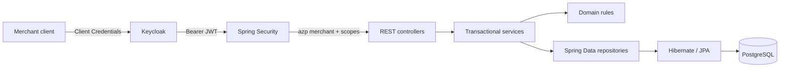

# Payment Sandbox API

[](https://github.com/Tawfik-Metwally/web-projects/actions/workflows/payment-sandbox-ci.yml)

A containerized REST API for learning and demonstrating payment creation,
merchant-scoped queries, idempotency, and full refunds. All payment decisions
are simulated. The project never processes real money or real card data.

## Status and scope

The planned API feature scope is complete and has been verified locally and in
CI. The project is a portfolio sandbox, not a production payment processor.

It provides production-oriented engineering practices in a deliberately limited
domain: transactional persistence, OAuth 2.0 authorization, merchant isolation,
concurrent idempotency, Problem Details, trace correlation, health probes,
metrics, automated verification, dependency auditing, and a hardened packaged
runtime.

The application is distributed as source plus a reproducible local Docker image.
It is not hosted and does not publish images through Continuous Delivery by
design: the completed educational project has no operated environment or external
image consumers.

## Capabilities

- deterministic approval or decline of simulated BRL payments;
- merchant-scoped payment lookup and paginated listing;
- full refunds with payment state transitions and chronological event history;
- persistent idempotency for payment and refund creation;
- replay, changed-payload conflict, and concurrent unique-constraint recovery;
- OAuth 2.0 Client Credentials with JWT validation through Keycloak;
- endpoint authorization through `payments:create`, `payments:read`, and
  `refunds:create` scopes;
- public health probes and protected metrics for an isolated operations client;
- RFC 9457 Problem Details, request trace correlation, OpenAPI, and Swagger UI.

## Architecture



The validated Keycloak `azp` claim becomes the merchant identity. Request
headers and query parameters cannot override it. `Payment` business rules remain
separate from `PaymentEntity` persistence mappings.

The application is a layered monolith. This keeps transactions and domain rules
explicit without introducing distributed-system boundaries that the sandbox does
not need.

## API operations

| Method | Path | Required scope | Purpose |
|---|---|---|---|
| `POST` | `/api/v1/payments` | `payments:create` | Create a simulated payment |
| `GET` | `/api/v1/payments/{paymentId}` | `payments:read` | Get one merchant-owned payment |
| `GET` | `/api/v1/payments` | `payments:read` | List merchant-owned payments |
| `POST` | `/api/v1/payments/{paymentId}/refunds` | `refunds:create` | Create a full refund |
| `GET` | `/api/v1/payments/{paymentId}/events` | `payments:read` | Read chronological payment history |

While the API is running, the executable contract is available at:

- OpenAPI JSON: [localhost:8080/v3/api-docs](http://localhost:8080/v3/api-docs)
- OpenAPI YAML: [localhost:8080/v3/api-docs.yaml](http://localhost:8080/v3/api-docs.yaml)
- Swagger UI: [localhost:8080/swagger-ui/index.html](http://localhost:8080/swagger-ui/index.html)

OpenAPI is the source of truth for request schemas, response schemas, validation
constraints, examples, headers, status codes, and operation security.

## Stack

- Java 25 and Spring Boot 4.1.1;
- Spring Web MVC, Spring Security, Spring Data JPA, and Actuator;
- PostgreSQL 17.11, Hibernate, and Flyway;
- Keycloak 26.7.4 with OAuth 2.0 and JWT;
- Maven, JUnit, Mockito, AssertJ, and Testcontainers;
- Spotless, PMD, JaCoCo, and GitHub Actions;
- Docker Compose and VS Code Dev Containers.

## Verification

The latest author-run `./mvnw clean verify` checkpoint passed 288 tests with no
failures, errors, or skipped tests. Spotless confirmed all 96 Java files were
formatted, PMD 7.28.0 reported no violations from the focused ruleset, and
JaCoCo analyzed 56 classes. The path-filtered `Payment Sandbox CI` workflow runs
the same verification for relevant pushes and pull requests.

The suite covers domain rules, validation, mapping, service transactions,
controllers, PostgreSQL persistence, JWT authentication and authorization,
merchant isolation, replay and conflict behavior, and concurrent idempotency.
Selected tests send genuinely signed tokens through the real decoder and Spring
Security chain while using disposable PostgreSQL containers.

The packaged-runtime smoke test was confirmed on 2026-10-01. It built the final
image, started isolated PostgreSQL, Keycloak, and API services, obtained a real
Client Credentials token, created and queried a payment, inspected container
hardening, and removed its temporary containers, network, and volume.

## Local development

Requirements:

- Docker Desktop with Linux containers;
- VS Code with Dev Containers;
- Postman Desktop for the manual HTTP scenario;
- DBeaver only when direct database inspection is desired.

For first-time setup, authentication, Postman, Swagger UI, Actuator, DBeaver, and
troubleshooting, follow the [complete local testing guide](docs/local-testing.md).

For an already configured environment, open this project folder in VS Code and
select **Dev Containers: Reopen in Container**. In Dev Container Bash at
`/workspace`, start the API with the isolated demo database:

```bash
./mvnw spring-boot:run -Dspring-boot.run.profiles=demo
```

The `demo` profile changes the database only. JWT authentication and scope
authorization remain enabled. Stop Spring Boot with **Ctrl+C**.

Useful local addresses:

| Service | Address |
|---|---|
| API | `http://localhost:8080` |
| Public health | `http://localhost:8080/actuator/health` |
| Liveness / readiness | `http://localhost:8080/actuator/health/liveness` and `/actuator/health/readiness` |
| Keycloak | `http://localhost:8180` |
| Swagger UI | `http://localhost:8080/swagger-ui/index.html` |

After obtaining a merchant A token as described in the guide, a representative
request is:

```http
POST http://localhost:8080/api/v1/payments
Authorization: Bearer <access_token>
Idempotency-Key: quickstart-001
Content-Type: application/json
```

```json
{
  "amount": 10000,
  "currency": "BRL",
  "merchantReference": "ORDER-QUICKSTART",
  "paymentMethodToken": "tok_approved"
}
```

Expected: `201 Created` with an `APPROVED` payment. An identical retry returns
`200 OK` with the same payment and `Idempotency-Replayed: true`. Never put real
tokens, credentials, or card data in committed files.

## Automated checks

Run these commands in Dev Container Bash without the `demo` profile:

```bash
./mvnw clean test
./mvnw spotless:check
./mvnw pmd:check
./mvnw clean verify
```

`clean test` compiles and runs the test suite. `clean verify` additionally runs
the configured quality checks and generates the JaCoCo coverage report at
`target/site/jacoco/index.html`. Surefire reports are written under
`target/surefire-reports/`, and PMD reports under `target/reports/`.

Generated `target/` content is ignored by Git. CI uploads the available Surefire,
JaCoCo, and PMD reports as a seven-day workflow artifact.

## Packaged runtime

The root Dockerfile uses a JDK build stage and a smaller JRE runtime stage. The
Compose service names the final image `payment-sandbox-api:local` and runs it as
the non-root user `spring:spring` with:

- a read-only root filesystem;
- an in-memory `/tmp` filesystem;
- all Linux capabilities dropped;
- `no-new-privileges` enabled;
- OCI title, description, and source labels.

Stop the regular development environment before using the packaged workflow,
because both modes expose the API on port 8080. From a host terminal with `.env`
configured:

```bash
docker compose --env-file .env -f compose.yaml up -d --build
docker compose --env-file .env -f compose.yaml ps
docker compose --env-file .env -f compose.yaml logs --follow api
```

Stop the services without deleting persistent data:

```bash
docker compose --env-file .env -f compose.yaml stop
```

For a disposable end-to-end check, use Windows PowerShell in the project folder:

```powershell
powershell.exe -NoProfile -ExecutionPolicy Bypass -File .\scripts\packaged-runtime-smoke-test.ps1
```

The script creates a separate Compose project and PostgreSQL volume, verifies
Keycloak discovery, API readiness, authentication, payment creation and query,
runtime hardening, and OCI metadata, then removes all temporary resources. It
reads the merchant secret from the ignored `.env` file and never prints it.

## Security, observability, and audit boundaries

Health probes are public and omit component details. Metrics and Prometheus
output require the operations-only `observability:read` scope. Other Actuator
paths and unconfigured API paths are denied.

Handled errors and Spring Security rejections use `application/problem+json`.
Every response contains `X-Trace-Id`; error bodies repeat that value in
`traceId`. Logs contain request summaries and controlled exception metadata,
but omit bodies, credentials, tokens, idempotency keys, and payment method
tokens.

The Spring Boot parent manages most dependencies. Tomcat 11.0.26 is temporarily
overridden because Spring Boot 4.1.1 manages an older release. Inspect its origin
before changing the override:

```bash
./mvnw dependency:tree -Dincludes=org.apache.tomcat.embed:tomcat-embed-core
```

Infrastructure image references combine readable tags with immutable
multi-platform digests. Review a current registry digest without starting an
image:

```bash
docker buildx imagetools inspect postgres:17.11-alpine3.24
docker buildx imagetools inspect quay.io/keycloak/keycloak:26.7.4
docker buildx imagetools inspect eclipse-temurin:25.0.4_7-jdk-noble
docker buildx imagetools inspect eclipse-temurin:25.0.4_7-jre-noble
```

Docker Scout can reproduce the point-in-time container audit:

```bash
docker build --pull -t payment-sandbox-api:audit .
docker scout cves --only-severity critical,high --only-fixed local://payment-sandbox-api:audit
docker scout cves --only-severity critical,high registry://postgres:17.11-alpine3.24
docker scout cves --platform linux/amd64 --only-severity critical,high registry://quay.io/keycloak/keycloak:26.7.4
```

A completed scan does not imply zero vulnerabilities. Evaluate findings against
maintainer advisories and actual component use. Docker Scout sends package
identifiers and image-layer metadata to Docker's service for analysis; it does
not upload the complete image.

## Project structure

```text
payments
|-- PaymentSandboxApiApplication.java
|-- config
|-- controller
|-- service          services and Command/Result contracts
|-- dto
|   |-- request      HTTP request bodies
|   `-- response     HTTP response bodies
|-- domain           Payment, Money, and business rules
|-- entity           JPA persistence mappings
|-- repository       Spring Data repositories
|-- security         Resource Server configuration and security errors
|-- observability    trace correlation
|-- exception
|-- enums
`-- simulator        deterministic provider simulation
```

Component tests mirror production packages. Full application and database tests
live under `integration`, security-specific tests under `security`, and shared
JWT helpers under `support`.

Infrastructure and local support files:

- `.devcontainer/`: VS Code development environment;
- `docker/keycloak/`: versioned realm, clients, scopes, and audience;
- `docker/postgres/`: local database initialization;
- `src/main/resources/db/migration/`: Flyway migrations;
- `.env.example`: secret-free local configuration template;
- `scripts/`: packaged-runtime verification;
- `.mvn/`, `mvnw`, and `mvnw.cmd`: Maven Wrapper.

`.env`, IDE state, generated build output, and private project records are
excluded from version control.

## Detailed documentation

- [Local testing guide](docs/local-testing.md): initial setup, Keycloak tokens,
  Postman, Swagger UI, Actuator, DBeaver, verification, and troubleshooting.
- [OpenAPI JSON](http://localhost:8080/v3/api-docs): executable HTTP contract
  available while the local API is running.
- [Swagger UI](http://localhost:8080/swagger-ui/index.html): interactive view of
  the same contract.
